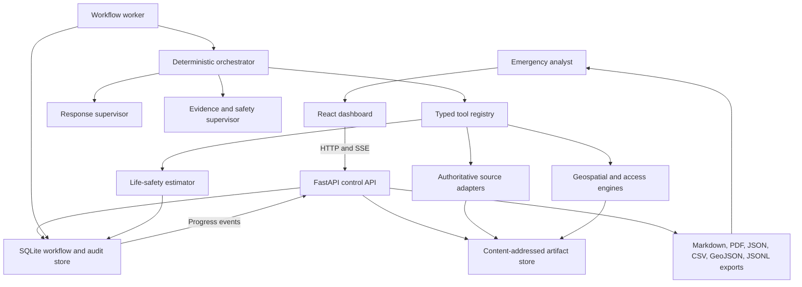
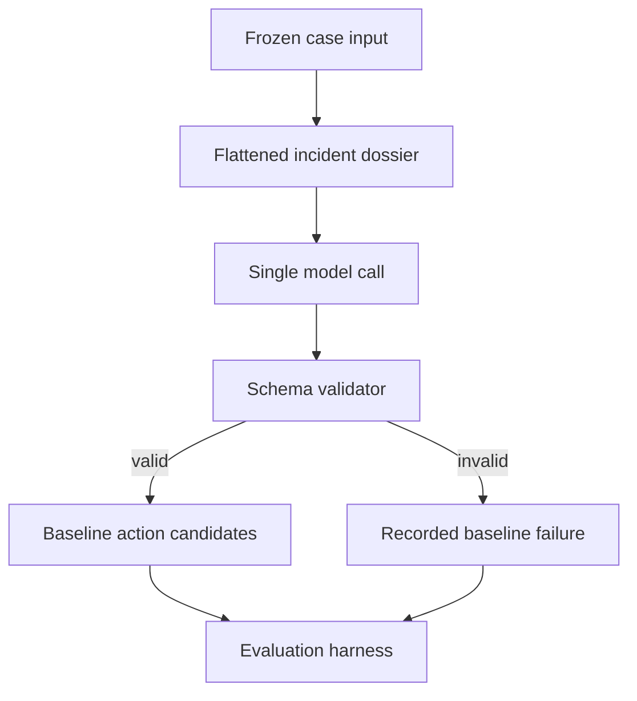
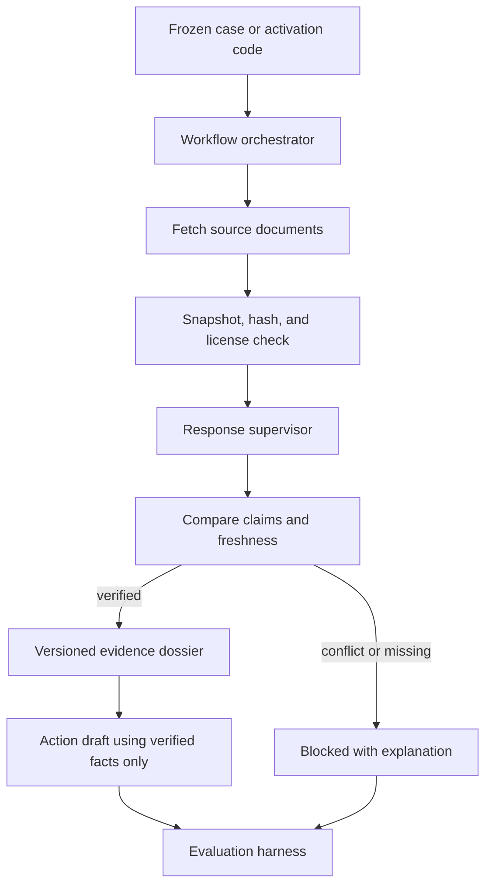
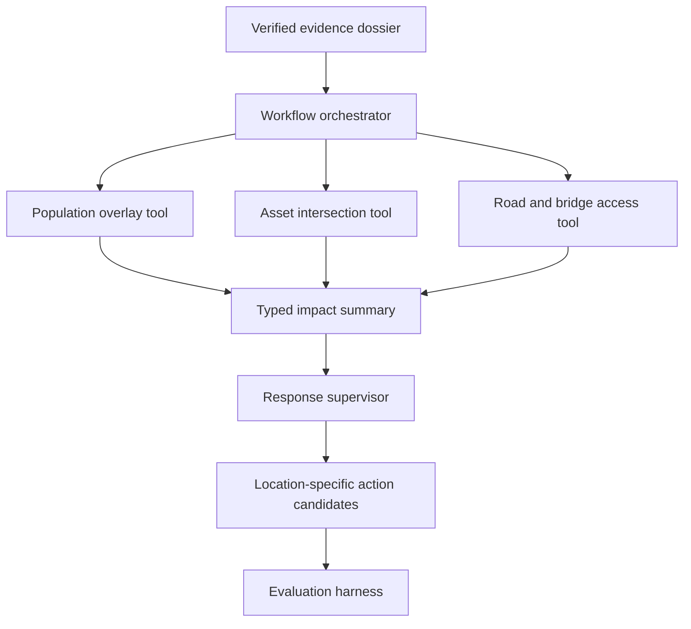
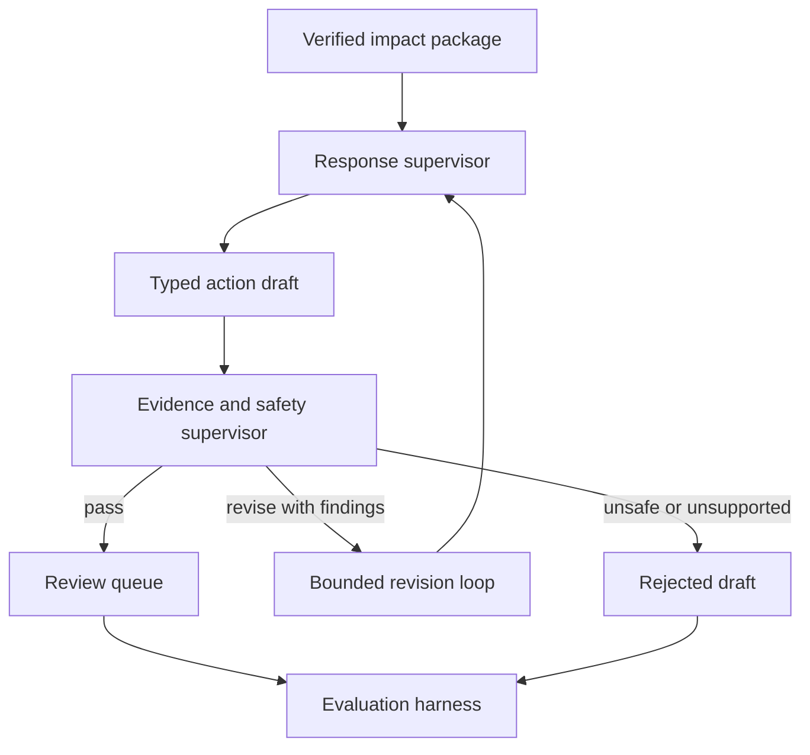
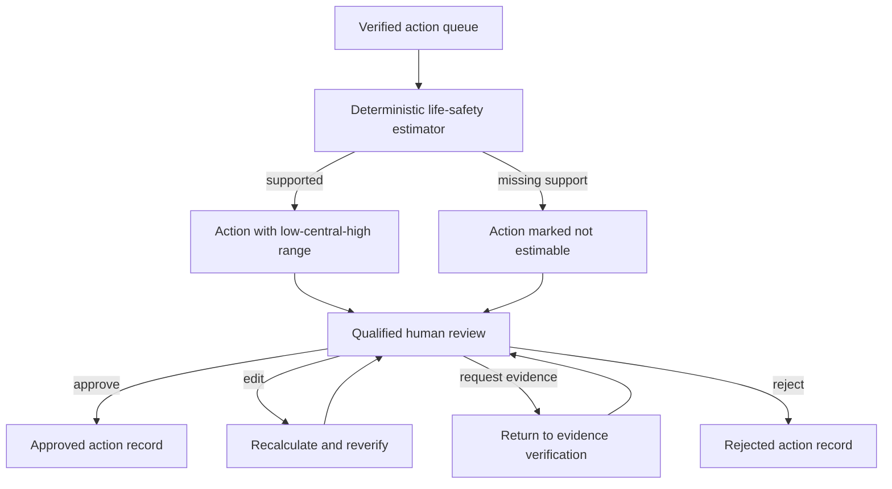
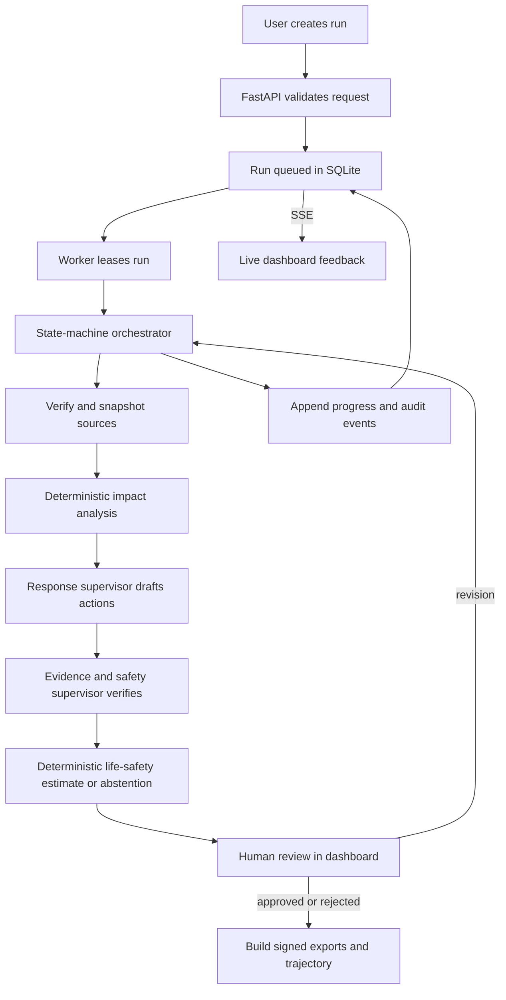

# ADR-0001: Iterative Agentic Architecture

Status: Accepted for initial implementation, subject to measured revision  
Date: 2026-08-29  
Decision scope: Micro1 flood and debris-flow MVP  
Beyond-MVP boundary: additional hazards through separate adapters  
Supersedes: none

## Context

The Climate Cascade Response Agent must turn a verified post-disaster event into a ranked, evidence-backed action queue that a qualified emergency-management reviewer can approve, edit, request evidence for, or reject.

The Micro1 submission requires a reasonable baseline, iterative improvements, measurable evidence, representative trajectories, and a clean reproduction path. The architecture must make each improvement independently runnable and observable. It must not hide deterministic work inside model prompts or add agents whose contribution cannot be measured.

The hackathon MVP supports floods and debris flows. Earthquakes, tsunamis, tornadoes, and volcanic eruptions remain beyond-MVP roadmap hazards. The shared workflow may be reused, but each later hazard requires its own adapter, benchmark, source policy, analysis, action policies, estimators, and safety evidence.

## Decision

Build a local-first system with:

- a React and TypeScript dashboard
- a Python FastAPI control API
- a separate Python worker running an explicit finite-state workflow
- SQLite in WAL mode for durable workflow, audit, and review state
- a content-addressed local artifact store for source snapshots and geospatial files
- one response supervisor agent
- one independent evidence and safety supervisor agent
- typed deterministic tools for retrieval, geospatial analysis, routing, scoring, estimation, and export
- server-sent events for visible run progress
- Pydantic contracts at every API, agent, tool, and persistence boundary
- a provider-neutral model gateway
- no vector database in the MVP

The deterministic workflow engine owns state transitions. Agents may propose work and call allowlisted tools, but they cannot approve actions, mutate workflow state directly, dispatch operations, or bypass validation.

## Architecture principles

1. **Baseline first:** Run the direct-prompt baseline before agent improvements.
2. **Least agency:** Use agents only for synthesis and judgment that deterministic code cannot provide.
3. **Code owns control:** Application code owns transitions, retries, timeouts, approvals, and exports.
4. **Typed boundaries:** Do not use unstructured inter-agent conversation or implicit shared state.
5. **Deterministic science:** Keep geospatial calculations, routing, scoring, and life-safety arithmetic outside the model.
6. **Evidence by reference:** Every claim, impact, action, and estimate carries evidence identifiers.
7. **Fail closed:** Missing sources, invalid schemas, unsafe outputs, and absent approval stop the workflow.
8. **Human authority:** Only a qualified reviewer can move an action to `APPROVED`.
9. **Visible execution:** Every stage, tool call, retry, warning, and decision emits a progress event.
10. **Measured complexity:** Add a role, tool, or memory mechanism only when evaluation demonstrates the need.

## System context



## Iterative architecture

All stages use the same `CaseInput`, `ActionCandidate`, and evaluation-output schemas. Each iteration adds one measurable capability and reruns the same frozen cases.

### Baseline: direct dossier to action list

The baseline is one structured model call. It is not described as an agent because it has no tools, memory, retries, or autonomous control loop.



Baseline constraints:

- same model family as the response supervisor where practical
- same case facts and required action schema as the improved solution
- no live retrieval, tools, memory, retry, verifier, or human-feedback loop
- one attempt only, with schema failure recorded rather than repaired
- outputs saved exactly as produced

### Iteration 1: verified event intake

Add the response supervisor, authoritative-source adapters, source policy, claim comparison, and immutable snapshots. The supervisor can reason about source agreement, but code performs downloads, hashes, validation, and state changes.



Expected measured effect:

- higher evidence precision
- fewer unsupported event claims
- correct abstention on source conflict
- explicit freshness and incomplete-data warnings

### Iteration 2: deterministic impact engine

Add population overlays, asset intersection, spatial deduplication, and bounded road-access analysis. The model receives compact typed results, not raw raster or vector data.



Expected measured effect:

- lower population relative error
- higher asset-impact F1
- zero undisclosed population duplication
- better location and access relevance in proposed actions

### Iteration 3: constrained action planning and independent verification

Add the evidence and safety supervisor. The response supervisor drafts actions. The independent supervisor receives the draft, evidence references, deterministic calculations, and policy rules. It cannot see hidden reasoning from the response supervisor and returns a typed verdict.



Expected measured effect:

- higher Life-Safety Action Coverage at 5
- zero unsupported final actions
- zero unsafe autonomous actions
- fewer actions with missing owners, evidence, dependencies, or time windows

The revision loop is capped at two attempts. Exhaustion moves the run to a visible blocked state rather than accepting the draft.

### Iteration 4: life-safety ranges and human feedback

Add deterministic low-central-high estimates, explicit abstention, editable assumptions, and qualified human review. Agents cannot write review decisions.



Expected measured effect:

- correct range coverage on synthetic fixtures
- correct `not estimable` behavior
- lower human review time
- complete reviewer rationale and assumption history

### Final design: integrated, reproducible workflow

The final design combines the retained iterations, exports all evidence, and exposes live progress to the dashboard.



## Agentic topology

### Deterministic orchestrator

The orchestrator is Python application code, not a model. It:

- leases queued runs
- enforces the finite-state transition table
- assembles bounded agent context
- invokes agents through `ModelGateway`
- validates every response against Pydantic schemas
- executes only stage-allowed tools
- applies retry and timeout policies
- records tool invocations and trajectories
- pauses for human review
- resumes from persisted state
- emits progress events
- builds exports after terminal decisions

### Response supervisor

Purpose: synthesize verified evidence and deterministic impact results into a small set of ranked, actionable proposals.

Allowed behavior:

- inspect the current evidence dossier and impact summary
- call allowlisted read-only evidence and impact-query tools
- identify missing evidence
- draft or revise typed actions
- recommend `blocked` when evidence is insufficient

Prohibited behavior:

- direct network, filesystem, database, or shell access
- changing workflow state
- approving an action
- inventing population or impact values
- calculating life-safety estimates
- issuing public alerts, dispatches, or operational commands

### Evidence and safety supervisor

Purpose: independently test every proposed action against evidence, deterministic results, and safety policy.

It verifies:

- every factual claim resolves to evidence
- action location and population match tool results
- affected populations are not silently duplicated
- owner, urgency, dependencies, and confidence are present
- no prohibited autonomous instruction is present
- life-safety estimate inputs are sourced or synthetic and labelled
- uncertainty and missing data remain visible

It returns `PASS`, `REVISE`, or `REJECT` with structured findings. It cannot approve an action for field use.

### Human reviewer

The reviewer is outside the agent topology. Only the review API can record:

- `APPROVE`
- `EDIT`
- `REQUEST_EVIDENCE`
- `REJECT`

Reviewer identity, role, rationale, timestamp, and changed assumptions are mandatory. Authentication can be a named local demo identity for the hackathon, but the audit schema must support a real identity provider later.

### Why there are only two model roles

Population analysis, asset intersection, route connectivity, scoring, estimation, persistence, and export are algorithms or application responsibilities. Turning them into agents would increase cost, latency, nondeterminism, and trajectory complexity without a clear evaluation benefit.

The two model roles have separable, measurable responsibilities: one drafts, one challenges. Any additional role requires an observed failure, a hypothesis, and an evaluation showing improvement.

## Agent communication contracts

Agents never send free-form messages directly to each other. The orchestrator passes versioned, validated objects.

### Shared request envelope

```python
class AgentRequest(BaseModel):
    schema_version: Literal["1"]
    run_id: UUID
    case_id: str
    stage: RunStage
    objective: str
    evidence_refs: list[UUID]
    impact_refs: list[UUID]
    current_actions: list[UUID]
    policy_version: str
    tool_allowlist: list[str]
    attempt: int
```

### Response supervisor output

```python
class SupervisorResult(BaseModel):
    schema_version: Literal["1"]
    status: Literal["DRAFTED", "BLOCKED"]
    actions: list[ActionCandidate]
    missing_evidence: list[EvidenceRequest]
    summary: str
```

### Evidence and safety supervisor output

```python
class VerificationResult(BaseModel):
    schema_version: Literal["1"]
    verdict: Literal["PASS", "REVISE", "REJECT"]
    findings: list[VerificationFinding]
    verified_action_ids: list[UUID]
    rejected_action_ids: list[UUID]
```

### Model gateway

```python
class ModelGateway(Protocol):
    def run_agent(
        self,
        config: AgentConfig,
        request: AgentRequest,
        tools: list[AgentTool],
    ) -> AgentResponse: ...
```

The provider adapter translates the common request into the selected model API. It must preserve tool inputs, tool outputs, token usage, model identifier, latency, and provider request ID where available.

## Tool contract and registry

Every tool has a stable name, version, Pydantic input and output schemas, side-effect classification, timeout, retry policy, and evidence behavior.

```python
InputT = TypeVar("InputT", bound=BaseModel)
OutputT = TypeVar("OutputT", bound=BaseModel)

class AgentTool(Protocol, Generic[InputT, OutputT]):
    name: str
    version: str
    side_effect: Literal["NONE", "SNAPSHOT", "WRITE_DRAFT", "EXPORT"]

    def execute(self, context: ToolContext, payload: InputT) -> OutputT: ...
```

The orchestrator calculates an idempotency key from `run_id`, stage, tool name, tool version, and canonical input hash. A repeated call returns the recorded result unless an explicit refresh policy permits a new snapshot.

### Agent-exposed tools

| Tool | Caller | Input | Output | Side effect |
| --- | --- | --- | --- | --- |
| `evidence.get_claims` | Both supervisors | Evidence IDs and optional claim filters | Supported, conflicting, preliminary, and missing claims | None |
| `evidence.request_detail` | Both supervisors | Evidence ID and bounded selector | Cited excerpt or structured metadata | None |
| `impact.get_summary` | Both supervisors | Run ID and AOI IDs | Population, assets, access, gaps, and confidence | None |
| `impact.query_assets` | Response supervisor | Geometry reference and asset classes | Matching affected assets with evidence IDs | None |
| `access.check_routes` | Response supervisor | Origin and destination references | Reachability, affected edges, and data gaps | None |
| `actions.submit_draft` | Response supervisor | Typed action candidates | Validated draft IDs or schema findings | Write draft |
| `verification.get_policy` | Evidence supervisor | Policy version and rule IDs | Exact safety and evidence rules | None |
| `estimate.preview_range` | Both supervisors | Action ID and approved parameter-set ID | Deterministic range or abstention reason | None |

### Orchestrator-only tools

| Tool | Why it is not agent-exposed |
| --- | --- |
| `sources.fetch_activation` | Performs external network access and source allowlist enforcement |
| `datasets.snapshot` | Writes files, hashes content, and records licensing metadata |
| `impact.build_population_overlay` | Runs deterministic raster calculations with controlled resources |
| `impact.build_asset_overlay` | Runs deterministic vector intersection and validation |
| `access.build_graph` | Builds and versions the bounded transport graph |
| `estimate.calculate_range` | Performs consequential arithmetic from approved parameter sets |
| `reviews.record_decision` | Accepts only authenticated human input |
| `exports.build_package` | Writes terminal artifacts only after review requirements are met |

### Tool access by stage

| Stage | Response supervisor | Evidence supervisor |
| --- | --- | --- |
| `SOURCE_CHECK` | Evidence claims and detail | Not invoked |
| `IMPACT_ANALYSIS` | Impact summary, assets, and routes | Not invoked |
| `ACTION_DRAFTING` | Evidence, impacts, routes, estimate preview, submit draft | Not invoked |
| `EVIDENCE_VERIFICATION` | Not invoked unless revision is requested | Evidence, impact summary, policy, estimate preview |
| `AWAITING_HUMAN_REVIEW` | No tools | No tools |

## Domain data models

All models include `schema_version`, stable UUIDs, UTC timestamps, and source references where applicable.

### Event and evidence

| Model | Important fields |
| --- | --- |
| `CaseInput` | `case_id`, run mode, activation code or URL, optional second source, operational constraints, fixture version |
| `VerifiedEvent` | Event type, names, time interval, geometry reference, verification status, source agreement, unresolved claims |
| `EvidenceItem` | Source URL, publisher, retrieved time, content hash, media type, license, snapshot path, freshness status |
| `EvidenceClaim` | Subject, predicate, value, units, validity time, evidence IDs, support status, confidence, notes |
| `DatasetSnapshot` | Dataset name, version, source URL, SHA-256, license, CRS, bounds, acquisition time, artifact reference |

### Impact

| Model | Important fields |
| --- | --- |
| `ImpactSummary` | AOI references, analysis coverage, exposed and affected population, asset totals, access findings, data gaps |
| `PopulationImpact` | Geometry reference, population source, total, exposed, reachable, deduplication group, uncertainty |
| `AssetImpact` | Asset ID, class, geometry reference, impact status, severity, evidence IDs, source completeness |
| `AccessImpact` | Origin and destination references, reachable status, affected edges, assumptions, graph version |
| `SecondaryHazard` | Hazard type, location, evidence status, severity, valid time, source IDs |

### Action and review

| Model | Important fields |
| --- | --- |
| `ActionCandidate` | Verb-first action, location reference, trigger, owner role, urgency, population basis, disaster impact, confidence, dependencies, evidence IDs |
| `LifeSafetyEstimate` | Action ID, low, central, high, unit, parameter-set ID, population deduplication ID, calculation version, abstention reason |
| `VerificationFinding` | Action ID, rule ID, severity, message, evidence IDs, suggested correction |
| `ReviewDecision` | Action ID, decision, reviewer ID and role, rationale, edits, timestamp, previous version |
| `ActionVersion` | Immutable action payload, version number, author type, parent version, verification status, review status |

### Workflow and audit

| Model | Important fields |
| --- | --- |
| `Run` | Case ID, mode, state, stage attempt, fixture version, config hash, lease, started and completed times |
| `RunEvent` | Monotonic sequence, event type, stage, status, message, evidence IDs, retry count, timestamp |
| `ToolInvocation` | Tool and version, input hash, output reference, status, latency, error class, idempotency key |
| `AgentInvocation` | Agent config hash, model ID, request and response references, tool IDs, token usage, latency |
| `ExportManifest` | Included artifacts, hashes, schema versions, generation time, review completeness |

## Workflow state contract

Allowed state progression:

```text
RECEIVED
  -> SOURCE_CHECK
  -> VERIFIED | BLOCKED
  -> DATA_SNAPSHOT
  -> IMPACT_ANALYSIS
  -> ACTION_DRAFTING
  -> EVIDENCE_VERIFICATION
  -> AWAITING_HUMAN_REVIEW
  -> APPROVED | REVISION_REQUESTED | REJECTED
  -> EXPORTED
```

Rules:

- transitions execute in a database transaction
- every successful transition appends a `RunEvent`
- an invalid transition returns `409 Conflict`
- a leased run has one active worker
- a stale lease can be reclaimed after a configured timeout
- retries do not rewind completed immutable artifacts
- `BLOCKED`, `REJECTED`, and `EXPORTED` are terminal for that run version
- a requested revision creates a new action version and returns to the narrowest required stage

## Persistence and memory

### Database decision

Use SQLite with SQLAlchemy 2 and Alembic for the MVP.

Reasons:

- no external service or cloud account is required for judges
- the workload is a single-user demonstration with bounded worker concurrency
- WAL mode supports the API reading progress while one worker writes
- the data volume is mostly metadata; large geospatial artifacts live outside the database
- SQL migrations and repository interfaces preserve a path to PostgreSQL later

Do not add PostGIS to the MVP. GeoPandas, Rasterio, Shapely, and NetworkX operate on pinned AOI files. Store geometry as GeoJSON references and artifact paths, not large rasters or complete vector packages in SQLite.

### Planned tables

| Table | Purpose |
| --- | --- |
| `runs` | Workflow state, mode, config hash, fixture, worker lease, timing |
| `run_events` | Ordered SSE and audit event stream |
| `evidence_items` | Source provenance and immutable snapshot metadata |
| `evidence_claims` | Structured claims and support status |
| `dataset_snapshots` | Versions, hashes, CRS, bounds, licenses, artifact paths |
| `impact_records` | Versioned population, asset, access, and secondary-hazard results |
| `actions` | Stable action identities |
| `action_versions` | Immutable action drafts and edits |
| `action_evidence` | Many-to-many action and evidence relationship |
| `estimates` | Deterministic ranges, parameters, versions, and abstentions |
| `verification_findings` | Evidence and safety supervisor findings |
| `reviews` | Human decisions, identities, roles, rationales, and edits |
| `tool_invocations` | Inputs, outputs, timing, errors, and idempotency |
| `agent_invocations` | Agent configs, prompts, responses, model usage, and tool links |
| `exports` | Manifest and output hashes |

### Content-addressed artifact store

Use a local path such as `var/artifacts/sha256/<prefix>/<hash>` for immutable source and generated artifacts. Human-readable manifests map logical names to hashes.

Store:

- source API responses and documents
- downloaded CEMS product archives
- clipped raster and vector fixtures
- deterministic calculation outputs
- full agent requests and responses
- export packages

Never store credentials, private information, or individual-level records.

### Memory model

The MVP does not need a vector database. Its memory is explicit and scoped:

| Memory type | Storage | Retrieval rule |
| --- | --- | --- |
| Run memory | SQLite run, events, actions, findings, and reviews | Query by `run_id` and current stage |
| Evidence memory | Evidence and claim tables plus immutable snapshots | Retrieve only cited IDs or bounded source sections |
| Tool memory | Tool invocation table and artifact outputs | Reuse by idempotency key and version |
| Policy memory | Versioned YAML and Markdown files | Load by exact configured version |
| Human feedback memory | Review and action-version records | Apply to current run or explicit evaluation analysis only |
| Trajectory memory | Agent and tool invocation records | Export for audit and representative submission trajectories |

The system does not automatically convert one reviewer's feedback into global policy. A human must deliberately promote a repeated lesson into a versioned policy or prompt change, then rerun the baseline and evaluation.

### Context assembly

Before invoking an agent, `ContextBuilder` supplies:

- the current objective and allowed stage
- compact verified-event summary
- unresolved claims and freshness warnings
- deterministic impact summary
- relevant action versions and verifier findings
- exact policy excerpts
- evidence and tool references available through allowlisted tools

Raw rasters, full source archives, unrelated run history, hidden model reasoning, and secrets never enter the prompt. Context limits and truncation decisions are recorded in the invocation.

## FastAPI contracts

All endpoints use `/v1`, JSON request and response bodies, Pydantic validation, UTC timestamps, structured error codes, and request correlation IDs.

| Method and path | Purpose |
| --- | --- |
| `GET /v1/health` | Process and database readiness |
| `GET /v1/cases` | List pinned demo and evaluation cases |
| `POST /v1/runs` | Create a `baseline` or `agent` run with an idempotency key |
| `GET /v1/runs/{run_id}` | Current state, stage, warnings, and artifact availability |
| `POST /v1/runs/{run_id}/resume` | Resume when blocked or revision prerequisites exist |
| `GET /v1/runs/{run_id}/events` | SSE stream using event sequence IDs for reconnect |
| `GET /v1/runs/{run_id}/impacts` | Population, asset, access, and gap summaries |
| `GET /v1/runs/{run_id}/actions` | Ranked action versions, evidence, estimates, and review state |
| `POST /v1/runs/{run_id}/actions/{action_id}/reviews` | Record a qualified human decision and rationale |
| `GET /v1/runs/{run_id}/trajectory` | Redacted agent, tool, retry, and checkpoint trajectory |
| `POST /v1/runs/{run_id}/exports` | Build exports after review requirements are satisfied |
| `GET /v1/runs/{run_id}/exports/{format}` | Download an approved export by manifest reference |

### Create-run request

```json
{
  "case_id": "nepal-emsr927-v1",
  "mode": "agent",
  "activation": "EMSR927",
  "secondary_source_url": null,
  "operational_constraints": [],
  "fixture_mode": true
}
```

### Review request

```json
{
  "decision": "REQUEST_EVIDENCE",
  "reviewer_id": "demo-incident-commander",
  "reviewer_role": "incident_commander",
  "rationale": "Route accessibility evidence is stale for the affected bridge.",
  "edits": []
}
```

### Error envelope

```json
{
  "error": {
    "code": "INVALID_STATE_TRANSITION",
    "message": "The run cannot be exported before human review is complete.",
    "retryable": false,
    "details": {},
    "correlation_id": "..."
  }
}
```

## Worker and concurrency model

Run the API and workflow worker as separate local processes.

- The API validates input and inserts a queued run.
- The worker atomically leases the next eligible run using a short SQLite transaction.
- Long-running network, model, and geospatial work occurs outside database transactions.
- The worker renews its lease between steps.
- Results and transitions commit atomically with new events.
- A crashed worker leaves durable state; another worker may reclaim an expired lease.
- The MVP defaults to one worker and one active run to keep resource use predictable.

This avoids Redis and Celery while preserving resumability. Add a real queue only when concurrent deployment requirements justify it.

## Planned configuration files

These paths describe the implementation contract. They are created when their owning iteration begins.

```text
config/
  app.yaml
  agents/
    response_supervisor.yaml
    evidence_safety_supervisor.yaml
  policies/
    sources.yaml
    safety.yaml
    actions-flood.yaml
  hazards/
    flood.yaml
  evaluation/
    benchmark-v1.yaml
prompts/
  response-supervisor.md
  evidence-safety-supervisor.md
.env.example
```

### Application configuration

`config/app.yaml` owns non-secret operational settings:

```yaml
schema_version: 1
database_url: sqlite:///var/climate-cascade.db
artifact_root: var/artifacts
fixture_mode: true
worker:
  concurrency: 1
  lease_seconds: 120
  poll_seconds: 1
workflow:
  max_agent_revisions: 2
  default_tool_timeout_seconds: 60
events:
  retention: all
```

### Agent configuration

Planned `config/agents/response_supervisor.yaml`:

```yaml
schema_version: 1
agent_id: response_supervisor
prompt_file: prompts/response-supervisor.md
model:
  provider_env: MODEL_PROVIDER
  name_env: SUPERVISOR_MODEL
  temperature: 0
  max_output_tokens: 6000
output_schema: SupervisorResult@1
tool_allowlist:
  - evidence.get_claims@1
  - evidence.request_detail@1
  - impact.get_summary@1
  - impact.query_assets@1
  - access.check_routes@1
  - estimate.preview_range@1
  - actions.submit_draft@1
retry:
  schema_repair_attempts: 1
  provider_attempts: 2
```

`config/agents/evidence_safety_supervisor.yaml` follows the same structure with a different prompt, `VerificationResult@1`, and only verification-safe tools.

Every run records the resolved configuration hash, prompt hash, model identifier, tool versions, and policy versions. Secrets exist only in environment variables described by `.env.example`; they never appear in YAML, trajectories, or exports.

### Hazard configuration

`config/hazards/flood.yaml` owns flood-specific source classes, units, required layers, action-policy version, and estimator parameter-set rules. Future earthquake, tsunami, tornado, or volcanic adapters must use separate files and evaluations rather than extending this file with ambiguous optional fields.

## Planned Python package boundaries

```text
backend/
  app/
    api/              # FastAPI routes and SSE
    domain/           # Pydantic models and enums
    workflow/         # State machine, leases, context builder
    agents/           # Model gateway and two agent roles
    tools/            # Typed tool registry and implementations
    sources/          # CEMS, USGS, Charter, fixture adapters
    geo/              # Population, asset, routing calculations
    estimates/        # Deterministic life-safety calculator
    repositories/     # SQLAlchemy and artifact-store interfaces
    exports/          # Markdown, PDF, JSON, CSV, GeoJSON, JSONL
    settings/         # YAML and environment loading
  migrations/         # Alembic migrations
  tests/
frontend/
  src/
    api/
    components/
    features/runs/
    features/impact/
    features/actions/
    features/evaluation/
config/
prompts/
data/fixtures/
evaluations/
```

Dependencies point inward toward `domain` contracts. Provider, database, source, and export implementations sit behind protocols so evaluation fixtures can replace live services.

## Downstream systems

### MVP downstream consumers

| Consumer | Contract |
| --- | --- |
| Dashboard | HTTP JSON plus reconnectable SSE progress events |
| MapLibre view | GeoJSON layer manifests and style metadata |
| Evaluation harness | Versioned run, action, metric, timing, cost, and trajectory JSON |
| Incident brief | Markdown and printable PDF generated from reviewed records |
| Analyst workflow | CSV action queue and GeoJSON map layers |
| Submission package | JSONL trajectories, checksums, configs, prompts, and reproduction metadata |

### Explicitly absent from the MVP

The system does not connect to emergency dispatch, public alerting, hospital systems, messaging platforms, infrastructure control, or government incident-command software. Any future integration must consume an approved export through a separately authenticated adapter. Agent tools will not receive direct credentials for those systems.

## Failure handling

| Failure | Behavior |
| --- | --- |
| Source unavailable | Retry only configured transient failures, then block with source and timestamp |
| Source conflict | Preserve both claims, mark unresolved, and prohibit unsupported certainty |
| Dataset incomplete | Analyze covered areas, label gaps, and never infer zero impact |
| Invalid agent schema | Allow one schema-repair attempt, then record failure |
| Provider timeout | Bounded retry with the same idempotent request reference |
| Tool timeout | Record typed error and retry only tools declared retry-safe |
| Geospatial validation failure | Stop impact analysis and preserve diagnostic artifacts |
| Verifier rejection | Reject the action or run a maximum of two revisions |
| Human requests evidence | Return to the narrowest evidence or analysis stage |
| Worker crash | Reclaim expired lease and continue from persisted state |
| Export failure | Keep reviewed records immutable and allow idempotent export retry |

Errors distinguish `TRANSIENT`, `INVALID_INPUT`, `MISSING_DATA`, `SOURCE_CONFLICT`, `POLICY_VIOLATION`, `MODEL_SCHEMA`, `TOOL_FAILURE`, and `INTERNAL` classes.

## Observability and trajectories

Every API request, run, agent invocation, tool call, and export carries a correlation ID.

Record:

- state transition and event sequence
- agent configuration and prompt hashes
- bounded agent request and structured response
- tool name, version, canonical input hash, output reference, timing, and status
- model identifier, token usage, latency, and cost when available
- retries and error classes
- verifier findings
- human decisions and edits
- artifact and export hashes

The dashboard uses the same `RunEvent` records as the audit. It does not maintain a separate optimistic story about what the worker is doing.

Representative submission trajectories are redacted views of the stored audit records, not manually reconstructed transcripts.

## Safety and security boundaries

- Network access is restricted to configured source adapters and host allowlists.
- Agents receive no shell, arbitrary HTTP, filesystem, database, or credential tools.
- Uploaded file types, sizes, CRS, geometry validity, and archive contents are validated.
- Source text is treated as untrusted data, never as instructions.
- Exports omit secrets, raw provider metadata that may contain identifiers, and disallowed data.
- Action text passes policy and evidence verification before human review.
- Review endpoints require an explicit reviewer identity and role, even in local demo mode.
- No action state implies real-world execution.

## Reproducibility contract

The implementation will provide:

- pinned Python and JavaScript dependencies
- database migrations
- small local fixtures with checksums and licenses
- exact baseline, agent, evaluation, and dashboard commands
- committed agent, prompt, policy, and hazard configurations
- deterministic random seeds where applicable
- fixture mode that requires no live source access
- a fresh-environment end-to-end test
- model, runtime, token, and approximate cost reporting

Live-source refresh is optional and produces a new snapshot version. It never silently modifies the frozen evaluation fixture.

## Verification strategy

### Contract tests

- Pydantic API, agent, tool, event, and export schemas
- configuration loading and unknown-key rejection
- schema-version compatibility failures
- tool allowlist enforcement

### Deterministic component tests

- raster population aggregation
- spatial deduplication
- vector asset intersection
- route reachability and affected-edge reporting
- low-central-high estimate arithmetic and abstention
- idempotency-key behavior

### Workflow tests

- every allowed and forbidden transition
- lease acquisition, expiry, and recovery
- retry caps and blocked states
- verifier revision exhaustion
- approval required before export
- SSE reconnect from event sequence ID

### End-to-end tests

- baseline run from pinned case to evaluation output
- agent run from pinned case to human review and export
- dashboard shows live stages, warnings, actions, evidence, and decisions
- clean environment reproduces headline metrics within tolerance

## Decisions rejected for the MVP

| Alternative | Decision and reason |
| --- | --- |
| Unstructured multi-agent group chat | Rejected because responsibilities, evidence, and failure ownership become difficult to measure |
| One agent per data source or geospatial operation | Rejected because those operations are deterministic adapters and tools |
| Agent framework as workflow authority | Rejected initially; a small explicit state machine is easier to validate and reproduce |
| Direct model access to arbitrary HTTP, SQL, files, or shell | Rejected because it expands the safety and prompt-injection surface |
| PostgreSQL and PostGIS | Deferred until concurrency or server-side spatial-query requirements justify them |
| Redis and Celery | Deferred because a durable SQLite lease is sufficient for the local judging workload |
| Vector database memory | Rejected until a measured retrieval failure demonstrates value over explicit evidence references |
| Automatic learning from reviewer feedback | Rejected because one review must not silently become global policy |
| One universal multi-hazard estimator | Rejected because hazard risks and intervention effects are not interchangeable |

## Consequences

### Positive

- each iteration has a visible architectural and metric delta
- judges can reproduce the system without cloud infrastructure
- the dashboard and audit share one source of truth
- agent roles remain purposeful and independently evaluable
- deterministic calculations remain testable
- failures and human decisions are durable
- additional hazards have a clean extension boundary

### Tradeoffs

- SQLite and one worker limit concurrency, which is acceptable for the MVP
- explicit contracts and migrations add initial implementation work
- source snapshots consume disk space
- two model calls in later iterations add latency and cost
- hazard adapters require separate engineering and evaluation rather than superficial reuse

## Implementation status

| Step | Status | Evidence |
| --- | --- | --- |
| 1. Define domain schemas and frozen case format | Complete | [Execution record](../execution/2026-08-29-01-domain-schemas-and-frozen-case.md), final `uv run pytest` with `10 passed` |
| 2. Implement the direct-prompt baseline and evaluation output | Implemented; Nepal challenging-case result recorded | [Baseline evaluation guide](../evaluation/baseline.md), [implementation record](../execution/2026-08-29-02-single-call-baseline.md), [evaluated result](../execution/2026-08-30-03-nepal-baseline-evaluation.md), and focused end-to-end tests |
| 3. SQLite migrations, repositories, artifact store, and run-event stream | Implemented | Alembic migration; SQLite WAL repository; immutable SHA-256 artifact store; monotonic persisted run events; `backend/tests/test_workflow_api.py` |
| 4. FastAPI run creation, status, SSE, and baseline endpoints | Implemented | `/v1/runs`, `/v1/baseline/runs`, run status, reconnectable SSE, and baseline artifact endpoints; `backend/tests/test_workflow_api.py` |
| 5. Worker lease and explicit workflow engine | Implemented | SQLite `BEGIN IMMEDIATE` lease claims, expiry reclaim, persisted state transitions, baseline pause at human review, and separate worker CLI; [execution record](../execution/2026-08-30-04-durable-workflow-api-and-worker.md) |
| 6-12. Source adapters, agents, tools, dashboard, benchmark, and reproduction hardening | Planned | Must follow the test and execution-evidence protocol |

## Implementation order

1. Define domain schemas and frozen case format.
2. Implement the single-call baseline and evaluation output.
3. Add SQLite migrations, repositories, artifact store, and run-event stream.
4. Add FastAPI run creation, status, SSE, and baseline endpoints.
5. Implement the worker lease and explicit workflow engine.
6. Implement source adapters and Iteration 1 evidence contracts.
7. Implement deterministic population, asset, and access tools for Iteration 2.
8. Add response supervisor configuration and bounded tool registry.
9. Add evidence and safety supervisor plus revision limits for Iteration 3.
10. Add life-safety calculator, human-review APIs, and versioned actions for Iteration 4.
11. Build dashboard review, evidence, map, progress, comparison, and export views.
12. Run the full benchmark, record retained and removed experiments, and harden reproduction.

## Evidence required to revise this ADR

Record a new ADR or amendment when:

- an additional agent role is proposed
- an agent needs a new side-effecting tool
- SQLite can no longer meet measured concurrency or query requirements
- a vector or semantic memory system is proposed
- the workflow authority moves to an agent framework
- a downstream operational integration is added
- another hazard adapter enters implementation
- safety, evaluation, or reproducibility evidence contradicts a current decision

Every change must update the solution-improvement changelog and project story, then rerun affected baseline and agent evaluations.
